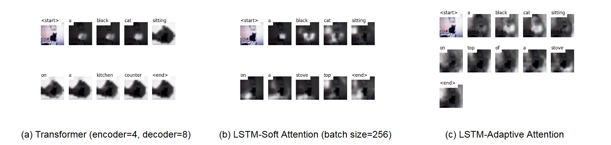
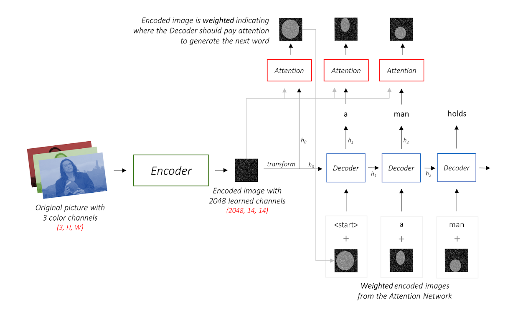
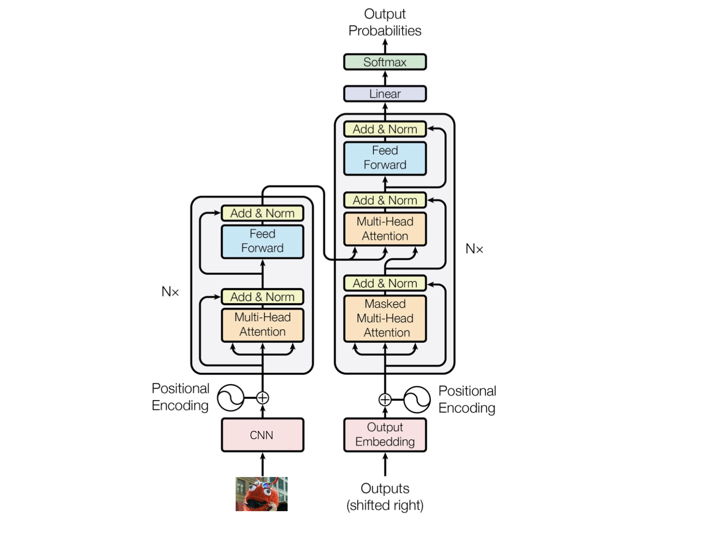

# Image Caption with CNN+RNN/LSTM/Tranformer


> This is the final project of *Neural Network & Deep Learning* course (SC4001), NTU.  We evaluated the RNN, LSTM, and Transformer decoders under a consistent configuration and experimented with various hyperparameter adjustments to enhance results. In particular, we integrated the adaptive attention mechanism into our framework as an advanced technique. Lastly, we visualized the caption-generation process to demonstrate the impact of attention mechanisms and conducted comprehensive automatic evaluations across the models.

## How to use

### 1. Create conda environment
```
conda create -n ic python=3.12
conda activate ic
pip install h5py tqdm imageio nltk scikit-image matplotlib
pip install torch torchvision torchaudio --index-url https://download.pytorch.org/whl/cu121
conda install openjdk
```

### 2. Prepare the data
Clone this repository.
```bash
git clone https://github.com/Evan-Sukhoi/Image-Caption-SC4001.git
cd Image-Caption-SC4001
```
Download and unzip the dataset files.
```bash
curl -o ./dataset/train2014.zip http://images.cocodataset.org/zips/train2014.zip &
curl -o ./dataset/val2014.zip http://images.cocodataset.org/zips/val2014.zip &
curl -o ./dataset/glove.6B.zip http://nlp.stanford.edu/data/glove.6B.zip &
curl -o ./dataset/caption_dataset/caption_datasets.zip http://cs.stanford.edu/people/karpathy/deepimagesent/caption_datasets.zip

unzip ./dataset/glove.6B.zip -d ./dataset/Glove 
unzip ./dataset/train2014.zip -d ./dataset
unzip ./dataset/val2014.zip -d ./dataset
unzip ./dataset/caption_dataset/caption_datasets.zip -d ./dataset/caption_dataset
```
Use tools to create input data files.

> Note: The `max_len` parameter specifies the maximum number of words allowed in each split caption. Here we use `18` for MSCOCO and `22` for Flickr30k according to the previous work.
```bash
# MSCOCO 2014
python create_input_files.py --dataset="coco" --max_len=18 --karpathy_json_path="./dataset/caption_dataset/dataset_coco.json" --image_folder="./dataset" --output_folder="./dataset/generated_data" &

# Flickr30k
python create_input_files.py --dataset="flickr30k" --max_len=22 --karpathy_json_path="./dataset/caption_dataset/dataset_flickr30k.json" --image_folder="./dataset" --output_folder="./dataset/generated_data" 
```
### 3. Train the model

#### 3.1 Choose model
Train `Transformer` using default parameters:
```bash
python -u train.py --mode="transformer"
```
Train `LSTM` using default parameters:
```bash
# Soft attention
python -u train.py --mode="lstm" --attention_type="soft"
# Adaptive attention
python -u train.py --mode="lstm" --attention_type="adaptive"
# Without attention
python -u train.py --mode="lstm-wo-attn"
```
Train `RNN` using default parameters:
```bash
# Without attention
python -u train.py --mode="rnn" --attention_type="none"
```
#### 3.2 Choose Parameters
The default dataset `train.py` uses is `coco` (MSCOCO2014). To change it for `flickr30k` or `flickr8k`, please use `--data_name` option. Examples:
```bash
python -u train.py --mode="lstm" --data_name=flickr30k_5_cap_per_img_5_min_word_freq
```
To fine-tune the CNN encoder and begin at specific epochs, use `--fine_tune_encoder=True` and `--fine_tune_encoder_start_epoch` options:
```bash
python -u train.py --mode="lstm" --fine_tune_encoder=True --fine_tune_encoder_start_epoch=10 --epochs=15 --data_name=flickr30k_5_cap_per_img_5_min_word_freq
```
To change the number of layers in encoder or decoder of Transformer, please use `encoder_layers` (default: 2) and `--decoder_layers` (default: 6) options.

The learning rates of encoder and decoder can be modified by `encoder_lr` (default: 1e-4) and `decoder_lr` (default: 1e-4) options.

### 4. Evaluate the model

To run `eval.py`, you must give the parameter of `--max_encode_length` and `--checkpoint`, which are corresponding to the dataset you are using, and the `--decoder_mode` of your model.
```bash
python eval.py --decoder_mode="transformer" --max_encode_length=18 --checkpoint="./models/BEST_checkpoint_epoch15_transformer_coco_5_cap_per_img_5_min_word_freq_.pth.tar" --beam_size=3
```
In this case, we use `--max_encode_length=18` becasue we limit maximum words to 18 of the COCO dataset as mentioned before.

### 5. Captioning
The parameters are similar with those of evaluation.
```bash
python caption.py --max_decoder_length=18 --img="./dataset/val2014/COCO_val2014_000000581886.jpg" --decoder_mode="transformer" --beam_size=3 --checkpoint="./models/BEST_checkpoint_transformer_e4d8_coco_5_cap_per_img_5_min_word_freq_.pth.tar"
```

## Result
All our pre-trained models were initially trained for a total of **15 epochs** and with **default** hyperparameters.

- **MSCOCO2014** 

    

    | Decoder     | Config              | B-1   | B-2   | B-3   | B-4   | METEOR | ROUGE_L | CIDEr  |
    |-------------|----------------------|-------|-------|-------|-------|--------|---------|--------|
    | LSTM        | w/o attention        | 0.7123 | 0.5435 | 0.4065 | 0.3039 | 0.2538 | 0.5249  | 0.9402 |
    | [LSTM](https://drive.google.com/file/d/14tFQQoE0mtGlPNaGp1dKefZFhEPHwue8/view?usp=sharing)        | soft attention       | 0.7123 | 0.5408 | 0.4057 | 0.3057 | 0.2582 | 0.5280  | 0.9674 |
    | [LSTM](https://drive.google.com/file/d/1mMDA7z1Zd-caPZBacCXc7p7n_FlOMD70/view?usp=sharing)        | adaptive attention   | 0.7139 | 0.5061 | 0.3383 | 0.2268 | 0.2704 | 0.5652  | 0.8038 |
    | [Transformer](https://drive.google.com/file/d/1tuhBvDYLtorTw4-PQ45W7rRzlH5vqBrq/view?usp=sharing) | encoder=4, decoder=8 | 0.7272 | 0.5631 | 0.4263 | 0.3232 | 0.2636 | 0.5389  | 1.0279 |


- Flickr30k

    | Decoder     | Config              | B-1   | B-2   | B-3   | B-4   | METEOR | ROUGE_L | CIDEr  |
    |-------------|----------------------|-------|-------|-------|-------|--------|---------|--------|
    | RNN         | w/o attention        | 0.6175 | 0.4280 | 0.2930 | 0.2000 | 0.2004 | 0.4333  | 0.4319 |
    | RNN         | soft attention       | 0.6272 | 0.3943 | 0.2378 | 0.1440 | 0.2235 | 0.4839  | 0.4768 |
    | LSTM        | w/o attention        | 0.6225 | 0.4339 | 0.2977 | 0.2026 | 0.2034 | 0.4384  | 0.4569 |
    | LSTM        | soft attention       | 0.6360 | 0.4491 | 0.3127 | 0.2161 | 0.2072 | 0.4477  | 0.4956 |
    | LSTM        | adaptive attention   | 0.6263 | 0.3915 | 0.2348 | 0.1421 | 0.2222 | 0.4794  | 0.4476 |
    | Transformer | encoder=4, decoder=8 | 0.6393 | 0.4091 | 0.2521 | 0.1560 | 0.2268 | 0.4873  | 0.4920 |

## Implement Details

### Model Input

**Images**: Preprocessing images by normalizing pixel values to the range [0, 1], followed by channel-wise nor-malization using ImageNet’s mean and standard deviation. Each image is resized to a uniform size 256x256 and reformatted to the NCHW convention, resulting in a Float tensor suitable for input to the pretrained ResNet101 model.
**Captions**: Captions are prepared by adding special tokens \<start> and \<end> to mark the beginning and end of each sequence. To ensure a uniform length across all captions, we pad shorter captions with \<pad> tokens. A word_map dictionary is created to convert each word into an index, transforming captions into integer tensors for model input.
**Caption Lengths**: We record the true lengths of each caption (including \<start> and \<end> tokens) in an integer tensor, allowing the model to process sequences up to their actual length and skip unnecessary computations on padding tokens.

### Model Architecture

#### CNN-RNN Architecture

The model consists of an Encoder-Decoder structure where the input image is first encoded by the Encoder into a feature representation. This encoded image feature is then processed by an Attention mechanism at each decoding step, guiding the Decoder on which parts of the image to focus on when generating each word in the caption. This enables the model to generate contextually relevant words based on different parts of the image.



**Soft Attention**: Soft attention is a deterministic approach that assigns a weight to each feature vector extracted from different regions of the image, allowing the model to focus on relevant parts of the image dynamically during caption generation. At each decoding step t, the attention mechanism computes an alignment score et,i for each image region i based on the annotation vector ai and the previous hidden state ht−1 of the LSTM. 

**Adaptive Attention**: Adaptive attention introduces a ”visual sentinel” mechanism that allows the model to decide when to attend to visual information and when to rely on linguistic context alone. This method addresses the limitation of traditional attention mechanisms, which often force the model to attend to visual features for every word generated, even when some words do not require visual grounding.

#### CNN-Transformer Architecture

We use the CNN-Transformer architecture, a pre-trained CNN is used as the encoder to extract spatial features from the image. These features are then processed by a Transformer with positional encoding to maintain the spatial structure of the image.



## References

1. Ghandi, Taraneh, Pourreza, Hamidreza, & Mahyar, Hamidreza. (2023). Deep learning approaches on image captioning: A review. *ACM Computing Surveys, 56*(3), 1-39. ACM New York, NY.

2. Vinyals, Oriol, Toshev, Alexander, Bengio, Samy, & Erhan, Dumitru. (2015). Show and tell: A neural image caption generator. In *Proceedings of the IEEE conference on computer vision and pattern recognition* (pp. 3156-3164).

3. Xu, Kelvin. (2015). Show, attend and tell: Neural image caption generation with visual attention. *arXiv preprint arXiv:1502.03044*.

4. Lu, Jiasen, Xiong, Caiming, Parikh, Devi, & Socher, Richard. (2017). Knowing when to look: Adaptive attention via a visual sentinel for image captioning. In *Proceedings of the IEEE conference on computer vision and pattern recognition* (pp. 375-383).

5. You, Quanzeng, Jin, Hailin, Wang, Zhaowen, Fang, Chen, & Luo, Jiebo. (2016). Image captioning with semantic attention. In *Proceedings of the IEEE conference on computer vision and pattern recognition* (pp. 4651-4659).

6. Vaswani, A. (2017). Attention is all you need. *Advances in Neural Information Processing Systems*.

## Acknowledgement

These works are helpful for this project: 
- [sgrvinod: a-PyTorch-Tutorial-to-Image-Captioning](https://github.com/sgrvinod/a-PyTorch-Tutorial-to-Image-Captioning)
- [jadore801120: attention-is-all-you-need-pytorch](https://github.com/jadore801120/attention-is-all-you-need-pytorch)
- [RoyalSkye: Image-Caption](https://github.com/RoyalSkye/Image-Caption)
